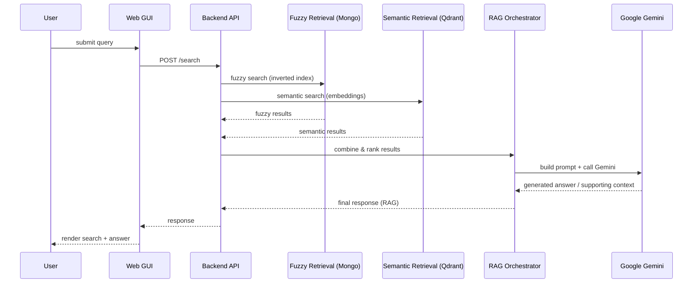

# IRS Project - Information Retrieval System

This project is an Information Retrieval System that includes a web crawler, an indexing system, a search engine (fuzzy and semantic), and a RAG (Retrieval-Augmented Generation) component using Google Gemini.

## Features

- **Web Crawler:** Crawls specified seed URLs to build a document database.
- **Fuzzy Search:** Uses an inverted index stored in MongoDB.
- **Semantic Search:** Uses vector embeddings stored in Qdrant.
- **RAG:** Enhances search results with AI-generated responses using Google Gemini.
- **Web GUI:** A modern web interface to interact with the system.

## Prerequisites

- [Docker](https://www.docker.com/) and [Docker Compose](https://docs.docker.com/compose/)
- A Google API Key for Gemini. You can get one from the [Google AI Studio](https://aistudio.google.com/).

## Setup and Running

1. **Clone the repository:**
   ```bash
   git clone <repository-url>
   cd IRSProject
   ```

2. **Configure Environment Variables:**
   Create a `.env` file in the root directory and add your Google API Key:
   ```env
   GOOGLE_API_KEY=your_google_api_key_here
   ```

3. **Run with Docker Compose:**
   ```bash
   docker-compose up --build
   ```

### Important Note on Startup

When you run the system for the first time, it will perform the following steps:
1. Initialize the MongoDB and Qdrant databases.
2. **Start the Crawler Pipeline:** The crawler is configured to fetch **2500 pages** by default.
3. **Wait for Completion:** You will need to wait until the crawler finishes processing all pages before the web application becomes accessible. This process can take a significant amount of time depending on your network and the seed set.

The console will show "Crawler finished. Starting Web Application..." when it's ready.

4. **Access the Web GUI:**
   Once the crawler finishes, open your browser and navigate to:
   ```
   http://localhost:5000
   ```

## Project Structure

- `crawler_pipeline.py`: The main entry point for the crawling and indexing process.
- `main.py`: The entry point for the web application.
- `Scripts/`: Database initialization scripts.
- `web_gui/`: Frontend and backend logic for the web interface.
- `contracts/`: Data models and shared interfaces.
- `rag/`: RAG system implementation.

## Tech Stack

- **Python 3.13**
- **MongoDB**: Stores documents and inverted index.
- **Qdrant**: Stores document embeddings for semantic search.
- **Google Gemini**: Powers the RAG and query improvement features.
- **Flask**: Serves the web interface.

## Architecture — Modular Monolith

This project is implemented as a modular monolith: a single deployable application that is organized internally as logically independent modules. The modular monolith approach was chosen to balance simplicity of deployment with clear separation of concerns.

Key architectural elements:

- Modules (logical boundaries):
  - Crawler: Responsible for fetching pages, extracting raw text and metadata, and normalizing content before handing it to the indexing layer.
  - Indexer / Inverted Index: Processes normalized documents to build and update the inverted index stored in MongoDB for fuzzy search.
  - Embedding Service: Produces vector embeddings for documents and queries and persists them into Qdrant for semantic retrieval.
  - RAG / Orchestrator: Coordinates retrieval (both fuzzy and semantic), constructs prompts, calls Google Gemini, and post-processes responses.
  - Web GUI / API: Exposes HTTP endpoints for search, administration, and monitoring; renders the interactive frontend.
  - Contracts / Shared Models: Contains data models and interfaces used by modules to ensure consistent data exchange.

- Internal communication:
  - Modules communicate through well-defined internal function interfaces and shared data stores rather than over the network. This keeps inter-module calls fast and straightforward while maintaining clear module ownership.
  - Long-running or background work (e.g., crawling, embedding generation) is executed by worker processes/tasks within the same application process or as separate worker processes that share the repository code and contracts.

- Data stores and responsibilities:
  - MongoDB: Primary store for raw documents, preprocessed content, and the inverted index structures used by fuzzy search.
  - Qdrant: Vector database that stores document embeddings and enables fast nearest-neighbor lookup for semantic search.
  - External APIs: Google Gemini for language-model-powered query improvements and RAG generation.

- Deployment model:
  - Single deployable unit (Docker image) that contains the application and exposes the web GUI and worker entry points. Docker Compose is used for local development and for composing the app with MongoDB and Qdrant.
  - The modular monolith makes local development, debugging, and CI simpler because you run one image and one codebase.

- Why a modular monolith?
  - Simpler deployment and testing: only one artifact to build, deploy, and run for development and small-scale production.
  - Clear module boundaries: code is organized by feature/module with explicit contracts to keep coupling low.
  - Easy to extract services later: if a module becomes a bottleneck, it can be refactored into its own service with minimal changes to interfaces.

- Scalability and evolution:
  - Scale vertically by allocating more CPU/memory to the monolith or by running multiple container instances behind a load balancer for the web/API surface.
  - Offload heavy background tasks to separate worker processes or a message queue (e.g., RabbitMQ, Redis queues) if throughput requirements increase.
  - If needed, individual modules (e.g., the crawler or embedding generator) can be split into microservices and communicate over HTTP or messaging while keeping the same contracts.

- Operational notes:
  - Use the Contracts folder to keep data models stable and versioned when evolving the system.
  - Monitor background workers and queue lengths to detect processing bottlenecks.
  - Keep the Qdrant index and MongoDB indexes documented so rebuilds can be automated.


## Architecture Diagrams

Below are two diagrams (component overview and a search/RAG sequence) rendered with Mermaid. GitHub renders Mermaid blocks in READMEs—if your viewer doesn't, you can use mermaid.live or export to an image.

### Component Overview

```mermaid
flowchart TB
  subgraph UserLayer
    U[User]
  end

  subgraph Web
    GUI[Web GUI / Frontend]
    API[Backend API (Flask)]
  end

  subgraph Core[Application (Modular Monolith)]
    Crawler[Crawler]
    Indexer[Indexer / Inverted Index]
    Embed[Embedding Service]
    RAG[RAG Orchestrator]
    Contracts[Contracts / Models]
  end

  subgraph Datastores
    Mongo[(MongoDB\nInverted Index & Docs)]
    Qdrant[(Qdrant\nEmbeddings)]
    Gemini[(Google Gemini\nExternal LLM API)]
  end

  U --> GUI
  GUI --> API
  API --> RAG
  API --> Indexer
  API --> Embed
  Crawler --> Indexer
  Crawler --> Embed
  Indexer --> Mongo
  Embed --> Qdrant
  RAG --> Gemini
  RAG --> Mongo
  RAG --> Qdrant
  Contracts --> Crawler
  Contracts --> Indexer
  Contracts --> Embed
  Contracts --> RAG

  style Core fill:#f9f,stroke:#333,stroke-width:1px
  style Datastores fill:#efe,stroke:#333,stroke-width:1px
```

### Search + RAG Sequence




